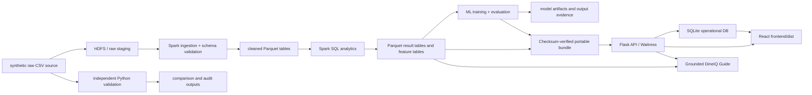

# DineIQ Architecture

The canonical analytics layer and the operational application layer are separate. The evaluator app serves a verified portable export; maintainers can also use the historical HDFS runtime. See INSTALLATION.md and RUNBOOK.md for supported commands.

## High-level view

## 1. Data generation layer

The generator in `scripts/data_generation/generate_dineq_dataset.py` creates a reproducible synthetic restaurant dataset and explicitly injects dirty-data conditions for benchmark, validation, and cleaning exercises.

The generated schema covers 11 related entities and the output is persisted into `data/generated/`.

## 2. HDFS and Spark layer

The canonical runtime uses Hadoop HDFS in Docker and a Spark session configured through `scripts/spark/common.py`.

The data flow is:

- raw CSV files are written to HDFS
- explicit Spark schemas validate the expected field types and keys
- cleaning and profiling scripts detect nulls, duplicates, mismatches, and anomalies
- final canonical tables are written to Parquet under HDFS output paths
- analytical output tables are stored as versioned evidence artifacts under the results tree

## 3. Parquet and analytics evidence

Spark writes processed and analytical results as Parquet. The Flask app reads either canonical HDFS paths or their verified exported equivalents through `app/artifacts.py`. The portable manifest preserves source provenance and validates file hashes; analytics loading checks row counts and schemas. The bundle contains the served aggregates, supplemental tables, evidence and both Spark models.

The canonical evidence is explicitly protected in the app by refusing to serve if a required path or attribute does not match the verified root, version, or model contract.

## 4. Independent Python validation

The independent Python pipeline reads the same generated source data and recomputes the same analytic quantities using pandas/scikit-learn. This validates the Spark outputs without replacing the canonical pipeline.

This layer matters because it provides a second implementation path for comparison evidence and for tables such as menu profitability and demand comparison.

## 5. ML layer

Two separate implementations exist:

- Spark MLlib demand model
- independent Python demand model

The project also includes a wastage-risk model and baseline comparison outputs. All models store versioned evidence in the `results/ml/` and `results/analytics/` trees.

## 6. Flask application layer

The Flask application in `app/backend.py` is designed to:

- load the canonical analytics outputs
- validate the persisted model and HDFS paths
- expose chart and export APIs
- serve the built React SPA from `frontend/dist/`
- leave the operational database separate from the canonical analytical source data
- serve the authenticated DineIQ Guide from reviewed formulas and already-loaded analytical tables

When a verified bundle is served directly on Windows and Hadoop's native helper is unavailable, the same API switches to a PyArrow Parquet reader plus bounded local predictors. The health endpoint identifies this runtime explicitly; Docker/Linux continues to load the persisted Spark pipelines.

The conversational layer in `app/chat_assistant.py` is deterministic and dependency-free. It resolves exact or disambiguated menu/outlet names, computes no new unverified business facts, and returns source references, confidence and a relevant dashboard route. It has no external model call, API key or network dependency. This keeps the evaluator path reproducible and prevents an unavailable model from fabricating project metrics.

## 7. SQLite operational layer

Operational records such as users, roles, admin actions, menu management, inventory, ratings, orders, and exports are stored in SQLite at `instance/dineq_operational.sqlite3`.

The operational store is intentionally separate from the canonical HDFS analytics so that:

- model artifacts are not overwritten by operational edits
- CRUD workflows remain auditable
- security and management features remain isolated from Spark analytics

## 8. Frontend layer

The front end is a React single-page application built from `frontend/` and served from `frontend/dist/`. The historical `app/static/` files are not the current serving entry point. It includes:

- authentication and session flow
- executive dashboard views
- operational management pages
- forecast and intelligence screens
- export and report access
- responsive layout checks for desktop and mobile widths
- a persistent responsive chat panel for simple English and Roman Urdu guidance

## 9. Evidence and traceability

The repository stores machine-readable evidence in `results/` for:

- generation
- cleaning and validation
- ingestion
- Spark analytics
- ML metrics
- browser verification
- SRS matrix compliance

This preserves the separation between verified evidence and narrative documentation.

## 10. Deployment boundary

The local serving container runs Waitress as UID 10001, mounts the bundle read-only and stores operational SQLite in a persistent volume. It binds to host loopback. A relocated-bundle verification passed with HDFS disabled; public deployment, TLS provisioning, managed secrets and production load validation remain unverified.

## 11. Submission validation boundary

`profile_clean.py` now validates source-preserving CSV, rejects malformed records, cascades rejected foreign-key parents and writes accepted/quarantine Parquet under separate versioned roots. The saved strict v2 outputs are under `/dineq/submission/`; they do not replace canonical v4. DATA_QUALITY_VALIDATION.md lists all executed rules and before/after counts. Dashboard recomputation and model retraining on the stricter accepted subset remain future work.
